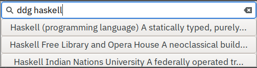
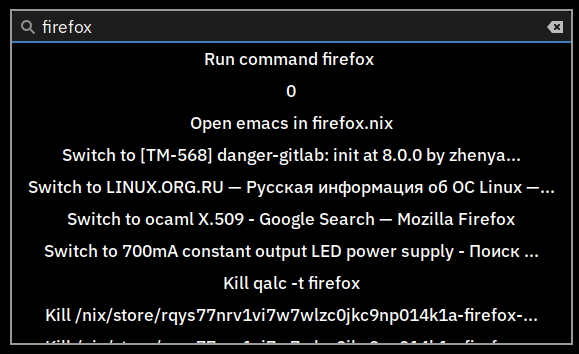

# λauncher 

λauncher is a GTK launcher application built with Haskell and 
gtk-gi-declarative.

## Screenshots

## Features

 -  Asynchronous plugin result loading
 -  No runtime settings (not a bug, but a feature)
 -  5M memory on coldstart, 20M memory when all plugins are loaded
 -  Very quick startup (compared to some other graphical launchers

## Configuration
All configuration at this moment is done by editing source files. This will be changed in the future to XMonad-style configuration.

### Plugins
To configure the plugins, edit `plugins :: [Plugin]` in `src/Main.hs`. You should be able to just edit the list of plugins to disable the unneeded ones. All of plugins are enabled by default.
#### Triggers
Apply `trigger` to a plugin to make it the only plugin shown when query starts with a trigger, and apply `triggerStrict` to show a plugin only when it's triggered.

### Window
Edit `configuration` top-level binding in `src/Main.hs`. The `Configuration` type constructor's field names should be self-explanatory.

## Building
### Nix
`nix build` should do everything for you.
### Cabal
`cabal new-run` works for me. If it doesn't, add an issue!

## Current list of plugins 
| Name            | Trigger | Description                                         | Required dependencies | Optional dependencies |
|-----------------|---------|-----------------------------------------------------|-----------------------|-----------------------|
| Command         | $       | run shell commands, with suggestions                |                       |                       |
| Duckduckgo      | ddg     | search the web with DDG instant answers             |                       |                       |
| Emacs           | em      | open emacs in a directory from ~/projects           | emacs                 | nix-shell             |
| Files           | file    | list and open files                                 |                       |                       |
| Google          | g       | search some text through google's web interface     |                       |                       |
| GoogleTranslate | tr      | translate words and phrases with Google's api       |                       |                       |
| Kill            | kill    | kill other processes                                | pkill, ps             |                       |
| Pass            | pass    | copy passwords from password store to the clipboard | pass                  |                       |
| Qalc            | q       | use libqalculate to evaluate expressions            | qalc                  |                       |
| Stackoverflow   | so      | search for questions with similar titles            |                       |                       |
| Sway            | sw      | list and focus windows on sway                      | swaymsg               |                       |
| Wiki            | wiki    | search english wikipedia                            |                       |                       |
| Wmctrl          | win     | list and focus windows on X11                       | wmctrl                |                       |

If a plugin doesn't work, make sure you've installed the corresponding dependencies!

## Extending
 -  Create `src/Plugins/YourPlugin.hs` that exports 
    `yourPlugin :: String -> IO [Types.Result]`
 -  Add the corresponding import to `src/Plugins/Main.hs`
 -  Don't forget to add `yourPlugin` to `plugins` list
 -  Send a PR!

## Code of conduct

All contributions are welcome! There are no restrictions.

## License

This work is in public domain. By sending Pull Requests you agree that
all of your work assosiated with this software is in public domain as
well.

This only applies to the code contained in this repository, to see
licenses of it's dependencies visit their respective pages.

## WARRANTY

THIS SOFTWARE COMES "AS IS", WITHOUT ANY WARRANTY (IMPLIED OR
OTHERWISE) TO THE EXTENT PERMITTED BY THE APPLICABLE LAWS. IT MAY
CAUSE DATA CORRUPTION OR LOSS. BY RUNNING THIS SOFTWARE YOU AGREE 
THAT IT'S AUTHOR(S) ARE NOT RESPONSIBLE FOR ANY DAMAGE CAUSED BY 
THIS SOFTWARE.

